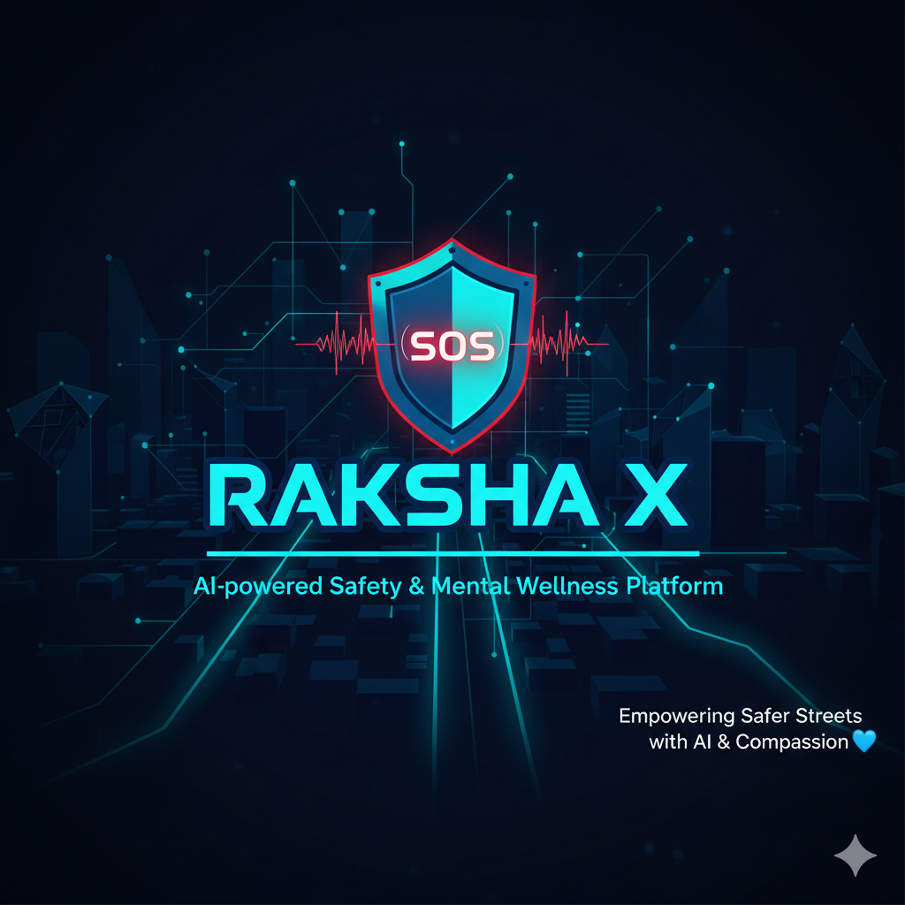

# 🚨 RAKSHA X – Safety & Support Platform  

> 🧠 AI-powered safety & mental wellness platform built with **Flask**, **TensorFlow (YAMNet)**, and **Gemini AI**.  
> Designed to make streets safer and mental health support more accessible.

---

## 🧰 Built With


---

## 🌟 Overview
**RAKSHA X** is a comprehensive Flask web application combining:  
- 🧭 Real-time **street safety navigation**  
- 🎮 **Interactive awareness game** on urban safety  
- 🔊 **Audio-based emergency detection** using YAMNet  
- 🚨 **SOS alerts** via Twilio WhatsApp integration  
- 💬 **Gemini-powered chatbot** for mental wellness support  

---

## 🚀 Features

### 🎮 Street Safety Game (`/game`)
- Interactive map navigation with safety zones  
- Real-time safety level feedback  
- Educational tips and warnings  

### 🔊 Audio Detection (`/detect`)
- Detects screams, gunshots, and explosions  
- Speech-to-text emergency keyword analysis  
- Auto-trigger SOS alerts  

### 🚨 SOS Alert System (`/sos`)
- WhatsApp alerts via Twilio API  
- Plays back audio evidence  
- One-click emergency contact notification  

### 🧠 AI Chatbot (`/chatbot`)
- Gemini-powered mental health chat  
- Crisis detection & emotional support  
- Resources and safety guidance  

## Project Structure

```
project/
├── app.py                 # Main Flask application
├── requirements.txt       # Python dependencies
├── README.md             # This file
├── templates/            # HTML templates
│   ├── index.html        # Main landing page
│   ├── game.html         # Street safety game
│   ├── detect.html       # Audio detection page
│   ├── sos.html          # Emergency SOS page
│   └── chatbot.html      # AI chatbot page
├── static/               # Static assets
│   ├── style.css         # Main stylesheet
│   ├── game.css          # Game-specific styles
│   ├── game.js           # Game JavaScript
│   ├── script.js         # Chatbot JavaScript
│   └── uploads/          # Audio file uploads
└── models/               # ML model utilities
    └── yamnet.py         # YAMNet classifier
```

## Installation

1. **Clone or download the project**
   ```bash
   # If using git
   git clone <repository-url>
   cd project
   ```

2. **Install Python dependencies**
   ```bash
   pip install -r requirements.txt
   ```

3. **Set up API keys** (Optional - for full functionality)
   - **Twilio**: Update `account_sid` and `auth_token` in `app.py`
   - **Gemini**: Update `GEMINI_API_KEY` in `app.py`

4. **Run the application**
   ```bash
   python app.py
   ```

5. **Access the application**
   - Open your browser to `http://localhost:5000`
   - Navigate between different features using the main page

## Usage

### Main Navigation
- **Home** (`/`): Overview of all features
- **Game** (`/game`): Street safety navigation game
- **Detect** (`/detect`): Upload and analyze audio files
- **SOS** (`/sos`): Emergency alert system
- **Chatbot** (`/chatbot`): AI mental health support

### Street Safety Game
- Use arrow keys or on-screen buttons to navigate
- Explore different streets to reveal safety levels
- Learn about safe, caution, and unsafe zones
- Get real-time safety tips and warnings

### Audio Detection
- Upload audio files (WAV, MP3, OGG supported)
- Automatic detection of emergency sounds
- Speech recognition for emergency keywords
- Automatic SOS trigger on danger detection

### Emergency SOS
- Manual SOS button for immediate help
- WhatsApp integration for emergency contacts
- Audio evidence playback
- Quick access to all safety features

### AI Chatbot
- Type messages to get AI-powered support
- Crisis detection and intervention
- Mental health guidance and resources
- Safety tips and emotional support

## API Endpoints

- `GET /` - Main landing page
- `GET /game` - Street safety game
- `GET /detect` - Audio detection page
- `POST /detect` - Process uploaded audio
- `GET /sos` - Emergency SOS page
- `GET /send_sos/<filename>` - Send WhatsApp SOS
- `GET /chatbot` - AI chatbot page
- `POST /chat` - Chatbot API endpoint
- `GET /crisis-resources` - Crisis resources API

## Configuration

### Twilio WhatsApp Setup
1. Create a Twilio account
2. Set up WhatsApp sandbox
3. Update credentials in `app.py`:
   ```python
   account_sid = "your_account_sid"
   auth_token = "your_auth_token"
   my_whatsapp = "whatsapp:+your_phone_number"
   ```

### Gemini API Setup
1. Get API key from Google AI Studio
2. Update in `app.py`:
   ```python
   GEMINI_API_KEY = "your_gemini_api_key"
   ```

## Dependencies

- **Flask**: Web framework
- **TensorFlow**: Machine learning framework
- **TensorFlow Hub**: Pre-trained models
- **YAMNet**: Audio classification model
- **Vosk**: Speech recognition
- **Librosa**: Audio processing
- **Twilio**: WhatsApp messaging
- **Google Generative AI**: Chatbot functionality

## Troubleshooting

### Common Issues

1. **Model loading errors**: Ensure stable internet connection for initial model downloads
2. **Audio processing errors**: Check file format compatibility
3. **Twilio errors**: Verify API credentials and phone number format
4. **Gemini errors**: Check API key validity and quota

### File Upload Issues
- Ensure `static/uploads/` directory exists
- Check file permissions
- Verify audio file format support

## Development

### Adding New Features
1. Create new route in `app.py`
2. Add corresponding template in `templates/`
3. Update navigation in `templates/index.html`
4. Add styles in `static/style.css`

### Customizing Styles
- Main styles: `static/style.css`
- Game styles: `static/game.css`
- Responsive design included

## License

This project is for educational and safety purposes. Please ensure responsible use of emergency features and API services.

## Support

For issues or questions:
1. Check the troubleshooting section
2. Verify all dependencies are installed
3. Ensure API keys are correctly configured
4. Check console logs for error messages

